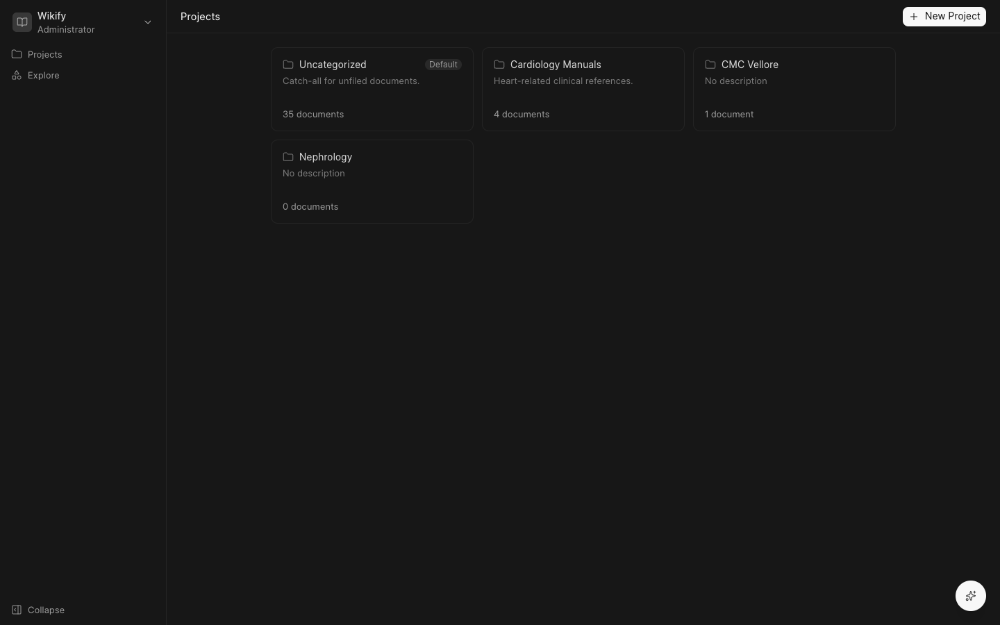
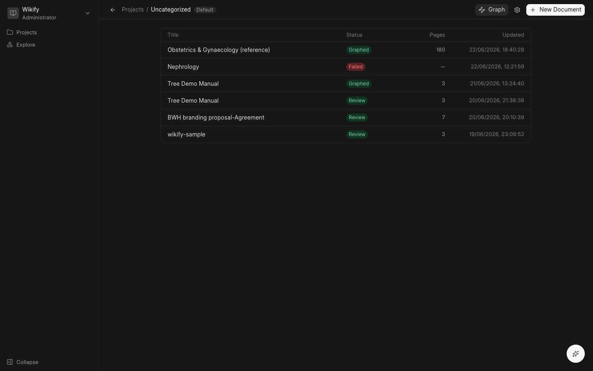
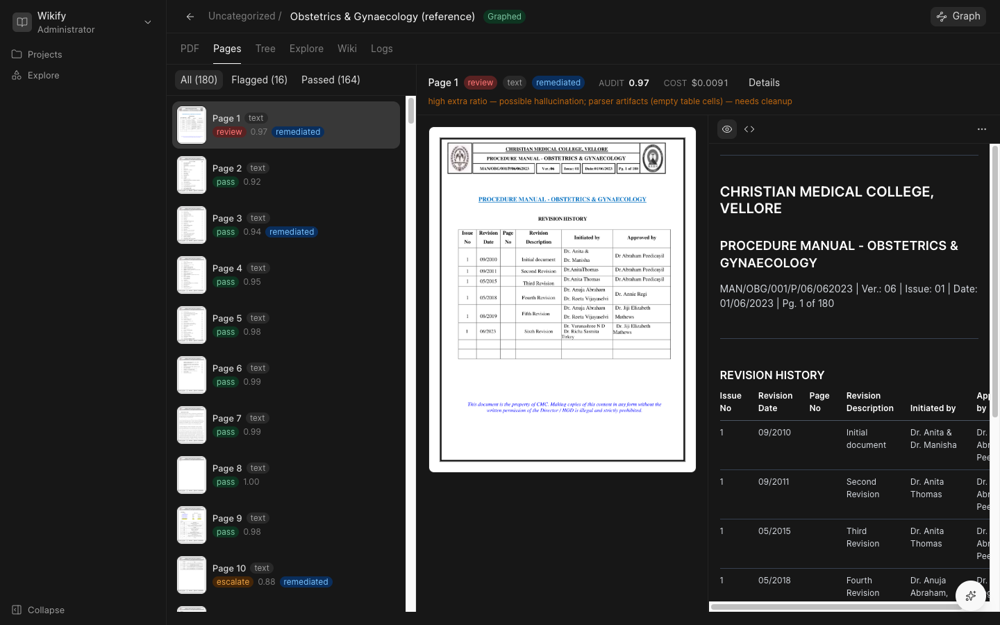
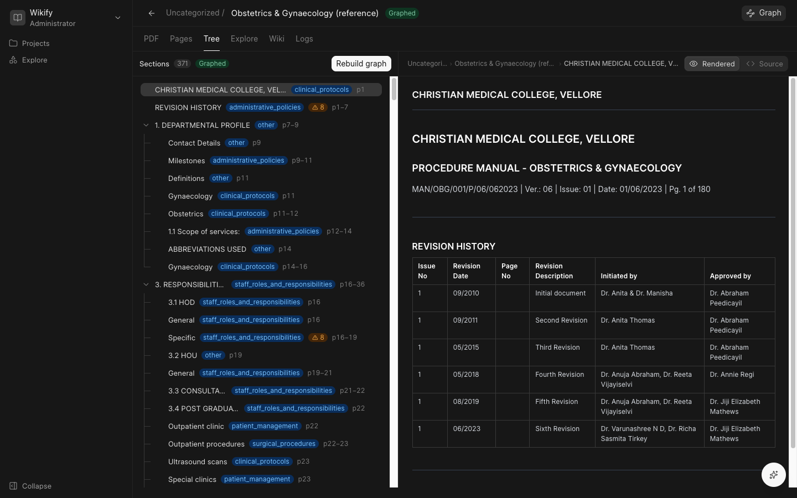
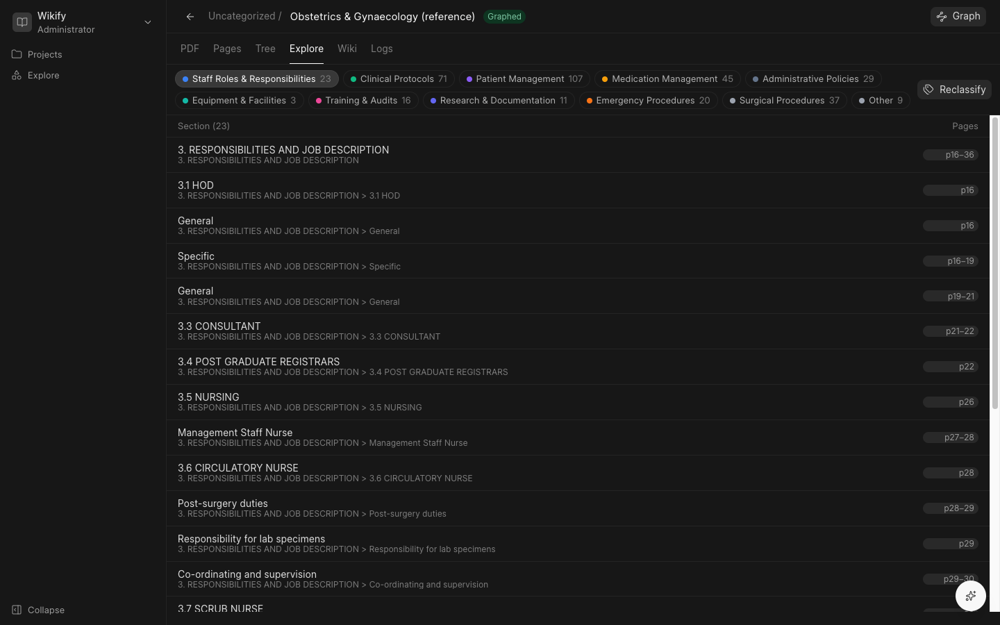
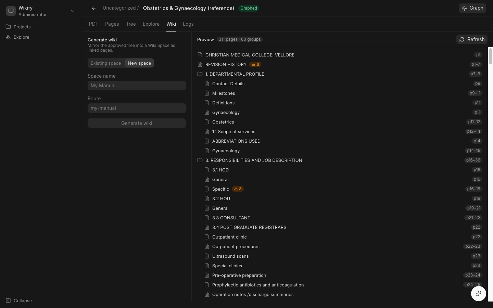
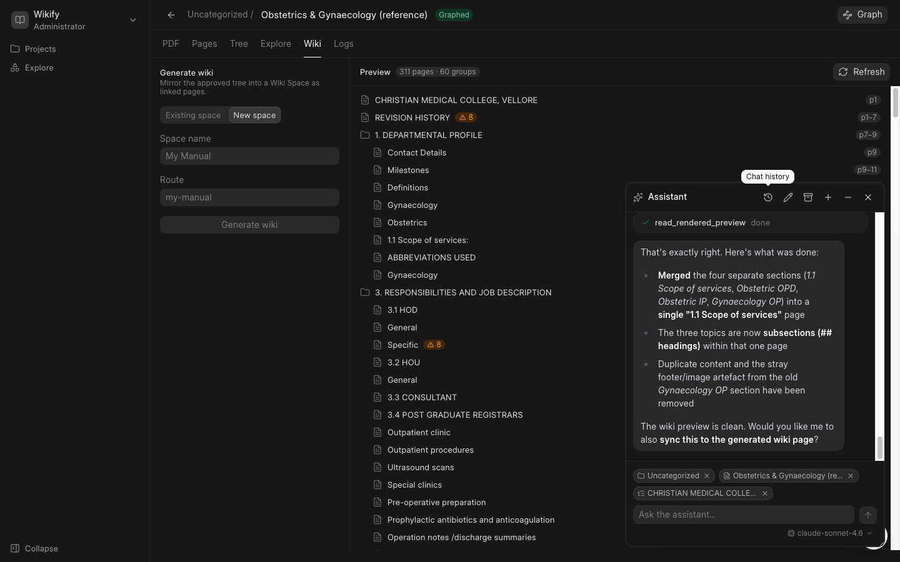

# What Wikify Is

Wikify turns a PDF manual into a wiki that people can read, search, and edit.

A printed manual is one long file. Nobody can link to page 47. Nobody can find every
safety rule across ten manuals. Wikify reads the PDF, checks its own work, splits the
content into sections, labels each section, and writes the result into a Frappe Wiki
space as linked pages.

You stay in control at every step. Wikify does the reading and the first draft. You
review it and approve it.

## Where your documents live

Documents sit inside **projects**. A project is a folder for one subject or one team.
Every project holds its own documents and its own set of labels.

Open a project to see its documents. Each row shows the title, the current status, and
the page count.

## How Wikify processes a PDF

You upload a PDF. Wikify then runs these steps in the background. A progress bar and a
live log show you where it is.

1. **Render each page as an image.** This image is what the AI models look at.
2. **Read the text off each page.** A local library called PyMuPDF pulls out the text
   layer. This is the baseline read, and it costs nothing.
3. **Score each page.** Wikify compares the text it read against the page itself. Part
   of the check is mechanical: how much of the text survived, and whether tables kept
   their shape. Part of the check uses an AI judge that looks at the page image. The
   two parts combine into one score between 0 and 1, plus a verdict of **pass**,
   **review**, or **escalate**.
4. **Repair the weak pages.** Every page also gets a second read by a vision model that
   works from the page image. Text pages get a third, cheaper read that removes headers
   and footers. Wikify keeps whichever version scores best. A better version is adopted.
   A worse version is thrown away.
5. **Build the section tree.** Wikify joins the pages back together, follows the
   headings and the PDF outline, and cuts the document into a tree of sections.
6. **Label every section.** A classifier model reads each section and assigns one label
   from the project taxonomy.
7. **Hand it to you for review.** The document status becomes *Review*. Nothing goes to
   the wiki until you approve it.

## Reading the page review

The **Pages** tab lists every page with its result. Click a page to see the original
next to the text Wikify produced.

Each page row carries a few small badges. This is what they mean.

| Badge | Meaning |
|---|---|
| **text** | Wikify judged this page to be mostly words. The text layer is trustworthy, so the mechanical checks carry most of the weight. |
| **visual** | The page is mostly a diagram, a scan, or a photo. There is little real text to compare against, so the AI judge decides the score almost alone. |
| **pass** / **review** / **escalate** | The verdict. *Pass* needs nothing from you. *Review* is worth a look. *Escalate* means Wikify has low confidence. |
| **0.97** | The page score. Higher is better. |
| **remediated** | Wikify replaced the first read with a better one. |

So the **text tag** is not a label you apply. Wikify sets it while it reads. It records
which kind of page it found, and it decides which checks are fair to run on that page.

## Sections and their labels

The **Tree** tab shows the document as a hierarchy. Each section carries its label and
its page range. You can drag sections to move them, rename them, or exclude them from
the wiki.

Labels are per project. A clinical project may use *Clinical Protocols* and *Patient
Management*. A legal project would use something else. The list starts small, and you
add labels only when the documents need them.

## Finding content across documents

The **Explore** view filters sections by label. It works inside one document and across
every document in the project. This answers questions like *show me every emergency
procedure we hold*.

## Generating the wiki

The **Wiki** tab previews the pages Wikify will create. You pick an existing wiki space
or create a new one, then generate. Wikify mirrors the approved tree into Frappe Wiki
and rewrites page-number references into real links.

## The assistant

Every screen has an assistant panel. It works on the document you are looking at, and it
already knows the current page, section, and tree. You talk to it in plain language.

The assistant can do the work you would otherwise do by hand.

- **Read.** It reads the section tree, a section, a page, the wiki preview, and the
  label list. It also searches sections by text.
- **Reshape the tree.** It moves, renames, creates, deletes, splits, and merges
  sections. It can also exclude a section from the wiki.
- **Fix content.** It edits a section body or a page body, and it rebuilds a section
  from its pages.
- **Manage labels.** It sets a section label and creates a new label when the taxonomy
  is missing one.
- **Re-run the pipeline.** It re-parses a page or a whole document, re-runs
  classification, and regenerates the wiki.
- **Ask you first.** For a change it is unsure about, it asks a question instead of
  guessing. Write actions show a confirmation card, and nothing is written until you
  approve.

The screenshot above shows a real session. The user said four sections should be one
page with subsections. The assistant read the sections, merged them, converted the
topics into subheadings, removed a duplicated footer, and then offered to sync the
generated wiki page.

## Which AI service Wikify uses

Wikify calls one service: **OpenRouter**. OpenRouter is a gateway that serves models
from several vendors through a single API and a single key. The key lives in Wikify
Settings.

Different jobs use different models, and each one is configurable.

| Job | Default model |
|---|---|
| Judge a page against its image | `anthropic/claude-sonnet-4.6` |
| Re-read a page from its image | `mistralai/mistral-medium-3.1` |
| Clean up page text | `google/gemini-2.5-flash` |
| Label a section | `google/gemini-2.5-flash` |
| The assistant | `anthropic/claude-sonnet-4.6` |

A project can override the assistant model. Wikify records the cost of every call, so
each page and each document shows what it spent.
