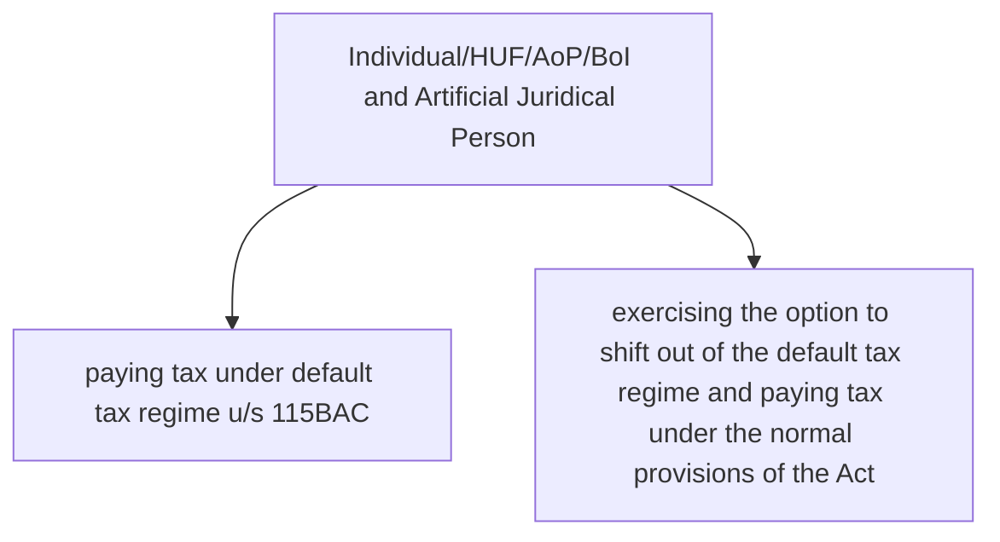

## II. SURCHARGE

Income-tax computed above would be increased by surcharge given under the following table:

**Individual/HUF/AoP1/BoI and Artificial Juridical Person**

### paying tax under default tax regime u/s 115BAC

| Particulars                                                                                                                                                                                                 | Rate of surcharge on income-tax |
|-------------------------------------------------------------------------------------------------------------------------------------------------------------------------------------------------------------|---------------------------------|
| (i) TI (including dividend income and capital gains chargeable to tax u/s 111A, 112 and 112A) > ₹ 50 lakhs but ≤ ₹ 1 crore                                                                                              | 10%                             |
| (ii) TI (including dividend income and capital gains chargeable to tax u/s 111A, 112 and 112A) > ₹ 1 crore but ≤ ₹ 2 crore                                                                                              | 15%                             |
| (iii) TI (excluding dividend income and capital gains chargeable to tax u/s 111A, 112 and 112A) > ₹ 2 crore                                                                                                               | 25%                             |
| Dividend income and capital gains chargeable to tax u/s 111A, 112 and 112A                                                                                                                                   | Not exceeding 15%               |
| (iv) TI (including dividend income and capital gains chargeable to tax u/s 111A, 112 and 112A) > ₹ 2 crore in cases not covered under (iii) above                                                                       | 15%                             |

### exercising the option to shift out of the default tax regime and paying tax under the normal provisions of the Act

| Particulars                                                                                                                                                                                                 | Rate of surcharge on income-tax |
|-------------------------------------------------------------------------------------------------------------------------------------------------------------------------------------------------------------|---------------------------------|
| (i) TI (including dividend income and capital gains chargeable to tax u/s 111A, 112 and 112A) > ₹ 50 lakhs but ≤ ₹ 1 crore                                                                                              | 10%                             |
| (ii) TI (including dividend income and capital gains chargeable to tax u/s 111A, 112 and 112A) > ₹ 1 crore but ≤ ₹ 2 crore                                                                                              | 15%                             |
| (iii) TI (excluding dividend income and capital gains chargeable to tax u/s 111A, 112 and 112A) > ₹ 2 crore but ≤ ₹ 5 crore                                                                                              | 25%                             |
| Dividend income and capital gains chargeable to tax u/s 111A, 112 and 112A                                                                                                                                   | Not exceeding 15%               |
| (iv) TI (excluding dividend income and capital gains chargeable to tax u/s 111A, 112 and 112A) > ₹ 5 crore                                                                                                                 | 37%                             |
| Dividend income and capital gains chargeable to tax u/s 111A, 112 and 112A                                                                                                                                   | Not exceeding 15%               |
| (v) TI (including dividend income and capital gains chargeable to tax u/s 111A, 112 and 112A) > ₹ 2 crore in cases not covered under (iii) and (iv) above                                                                 | 15%                             |

1 (other than an AOP consisting of only companies as members)